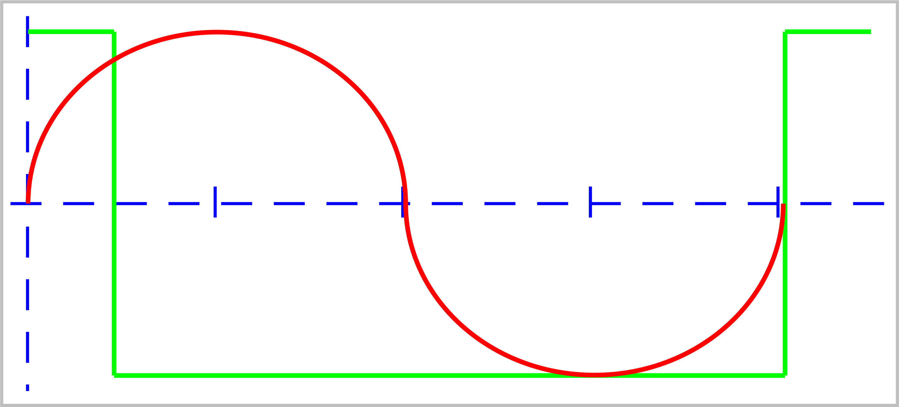

## SineWaveGen



SinWaveGen is a synchronised sinewave generator that takes a
square input on an Arduino Uno, Nano, etc digital pin and
outputs a loosely synchronised sinusoid wave as opposite
polarity PWM signals on pins 5 (+ve) & 6 (-ve). It's 
designed to be compatible with pedalShield Uno for example.
(Pin changes necessary for that, mind.)
 
It's intended to test the timings and reliability when
generating a sychronised sinewave at frequencies equal to
the first 2 octaves of a bass guitar and whether it's 
feasable as a tone generator for "top secret" guitar pedal. 
It would probably be used in conjunction with an analog VCA
and Attack/Decay circuit as I'm not sure at this stage if an
AT328p has the bandwidth to do that digitally, without 
writing the sketch entirely in assembly code. I'm pretty
sure that option is beyond me at this stage.

(```<thinks>``` Hmm, it probably is doable, really. What 
have I to lose trying? **NOTHING!**)

My aim is to create this in pure C/C++ code, in order to 
make it compatible with almost any microcontroller.

ToDos:  Turn off output when input timing is null
        Create proper C++ class with header and source

### Please Note
The project here is setup for development in PlatformIO, to
use with ArdinoIDE, download the "src" directory, change 
the name of the SinWaveGen.cpp file to SinWaveGen.ino, add
Thomas Fredericks' Chrono library to ArduinoIDE, comment
out (or delete) the very first line of SinWaveGen.ino, 
eg ```//  #include Arduino.h``` and you're good to build. 

©2023 [Crunchysteve bandmassa@gmail.com](bandmassa@gmail.com) 
Modified MIT licence, commercial developers should negotiate 
a paid licence with the above author.
